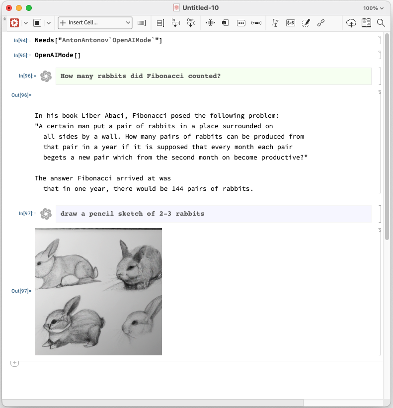
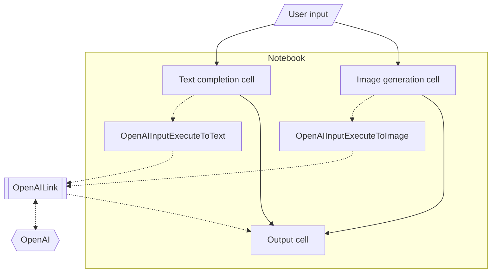

# OpenAIMode WL paclet

## Introduction

This repository has the code and documentation of Wolfram Language (WL) (aka Mathematica) 
paclet that provides a notebooks style with 
[OpenAI](https://platform.openai.com)
interaction cells.

It is assumed that the user of this paclet has:

- An [OpenAI](https://platform.openai.com) account (i.e. authorization token)
- Installed the [paclet "OpenAILink"](https://resources.wolframcloud.com/PacletRepository/resources/ChristopherWolfram/OpenAILink/)
- Followed the [setup steps of "OpenAILink"](https://resources.wolframcloud.com/PacletRepository/resources/ChristopherWolfram/OpenAILink/tutorial/ConfiguringOpenAICredentials.html)

## Installation

1. Install the 
[paclet "OpenAILink"](https://resources.wolframcloud.com/PacletRepository/resources/ChristopherWolfram/OpenAILink/)
and follow the setup steps.

```mathematica
PacletInstall["ChristopherWolfram/OpenAILink"]
```

2. Install the
[paclet "OpenAIMode"](https://resources.wolframcloud.com/PacletRepository/resources/AntonAntonov/OpenAIMode/).

```mathematica
PacletInstall["AntonAntonov/OpenAIMode"]
```

-----

## Usage

This screenshot should give a good idea of paclet's utility:



This flowchart shows the execution steps while using "OpenAIMode":



----- 

## Guides and demos

See the demo video ["OpenAIMode demo (Mathematica)"](https://www.youtube.com/watch?v=htUIOqcS9uA).

Here are the corresponding slides (in Markdown): 
["OpenAIMode-demo.md"](https://github.com/antononcube/MathematicaForPrediction/blob/master/MarkdownDocuments/OpenAIMode-demo.md).

The corresponding presentation notebook can be obtained
(from [Community.wolfram.com](https://community.wolfram.com))
[here](https://community.wolfram.com/groups/-/m/t/2864162).

